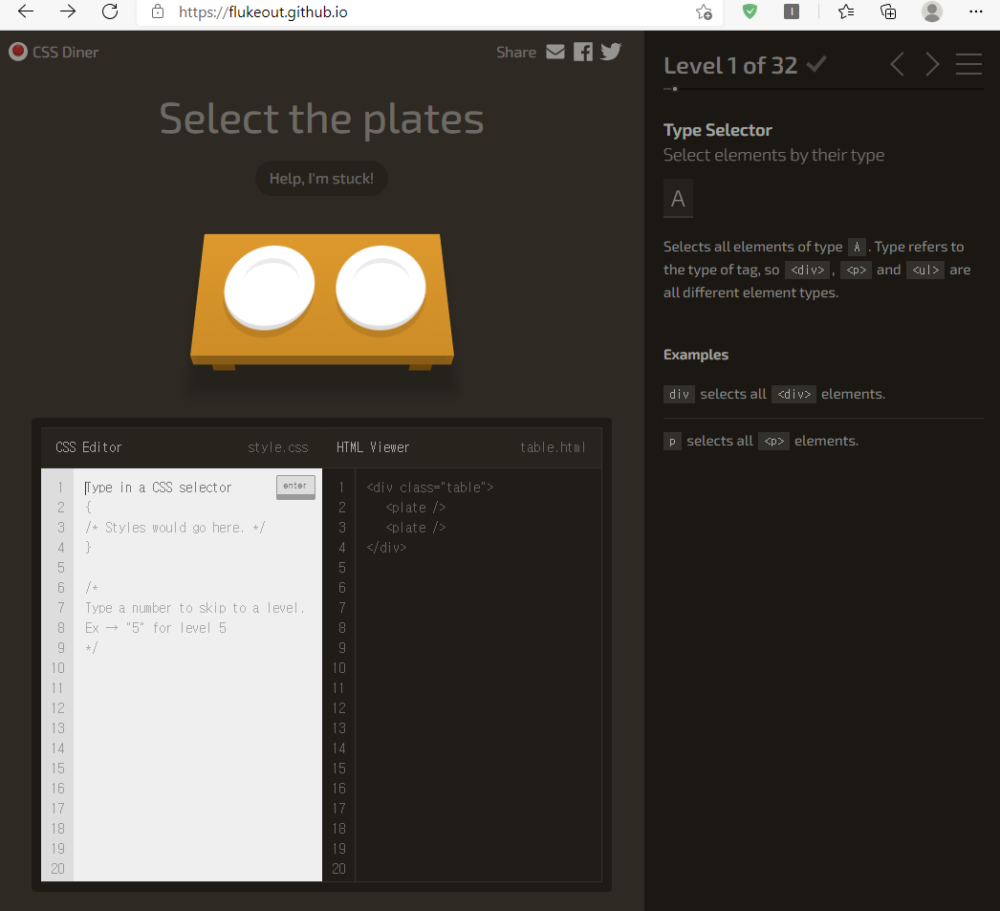

Html, CSS, JS
 

---

### Refer.
https://ko.javascript.info/  
https://www.w3schools.com/  
https://developer.mozilla.org/ko/
https://opentutorials.org/course/3083  

 

---

### CSS selector
CSS Diner : https://flukeout.github.io/  

 

#### solution
- 01 `plate`
- 02 `bento`
- 03 `#fancy`
- 04 `plate > apple`
- 05 `plate#fancy > pickle`
- 06 `apple.small`
- 07 `orange.small`
- 08 `bento orange.small`
- 09 `plate, bento`
- 10 `*`
- 11 `plate *`
- 12 `plate + apple`
- 13 `bento ~ pickle`
- 14 `plate>apple`
- 15 `plate>orange:first-child`
- 16 `plate apple:only-child, plate pickle:only-child`
- 17 `.small:last-child`
- 18  `plate:nth-child(3)`
- 19 `bento:nth-last-child(3)` ??
- 20 `apple:first-of-type`
- 21 `plate:nth-of-type(even)`
- 22
- 23
- 24
- 25 `bento:empty`
- 26 `apple:not(.small)`
- 27 `[for]`
- 28 `plate[for]`
- 29 `bento[for="Vitaly"]`
- 30 `[for^="Sa"]`
- 31 `[for$="ato"]`
- 32 `[for*="obb"]`